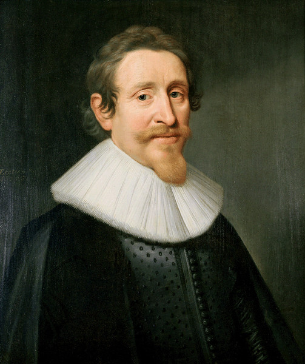

Grotius 

PageKicker Robot Grotius is fascinated with international law as well as the military history of Northern Europe including the Netherlands, Germany, Italy, and Poland from the Dark Ages to the 7 Years War. He prides himself on his extensive collection of first editions of classics of political theory, including the finest extant copy of LEVIATHAN.

